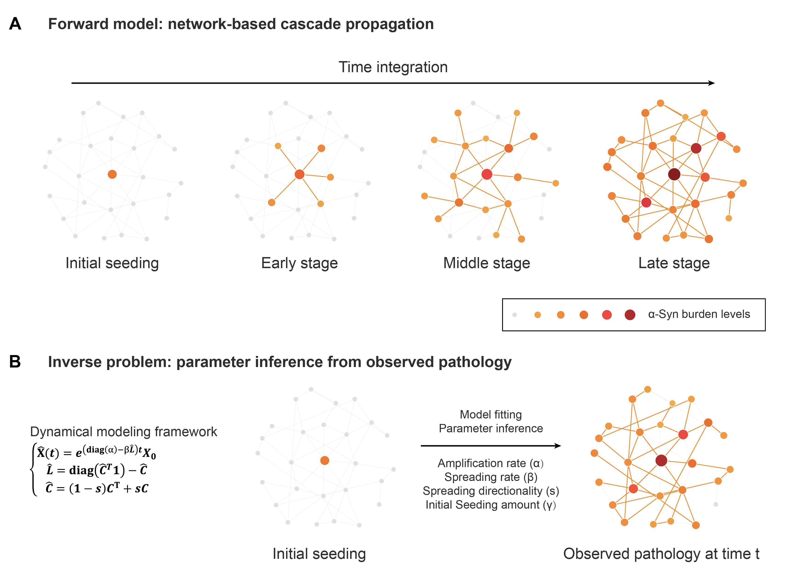
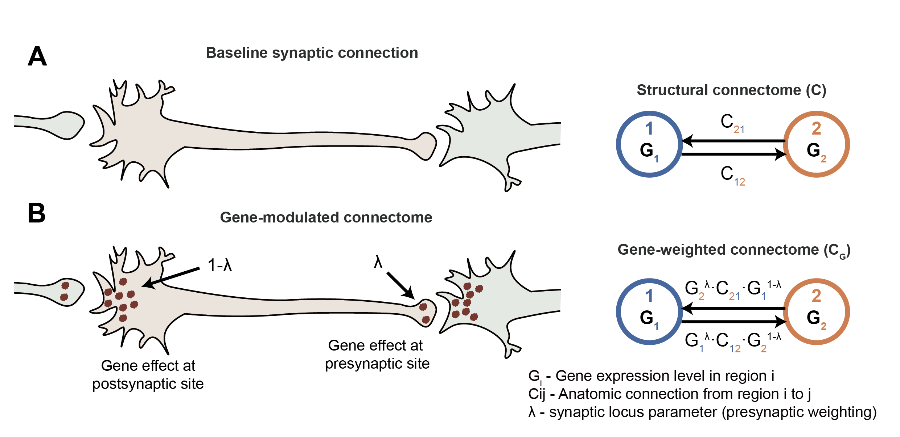

# MSA-α-Syn Propagation Model

Mathematical modeling and visualization code for brain-wide propagation of patient-derived MSA-α-Syn and PFF.

## Associated Manuscript

**Decoding brain-wide propagation dynamics of patient-derived pathological α-synuclein identifies therapeutic compounds that suppress pathological transmission**

Yuanxi Li<sup>a</sup>, Shujing Zhang<sup>a</sup>, ..., Ashish Raj<sup>&ast;</sup>, Chao Peng<sup>&ast;</sup>, et al.

<sup>a</sup> Co-first authors  
<sup>&ast;</sup> Corresponding authors

The associated manuscript is currently unpublished and has not been posted on bioRxiv. Please cite the manuscript when it becomes available.

## Overview

This repository contains the mathematical modeling and visualization code used to investigate brain-wide propagation of patient-derived pathological α-synuclein isolated from multiple system atrophy brain tissue (MSA-α-Syn). α-synuclein preformed fibrils (PFF) were analyzed as a reference condition.

Brain-wide regional pathology measurements were integrated with the mouse mesoscale structural connectome using a network-based dynamical model. The analyses were designed to:

- Estimate the initial seeding amount, local amplification/clearance rate, connectome-mediated spreading rate, and spreading directionality.
- Compare the propagation dynamics of MSA-α-Syn and PFF.
- Evaluate the robustness of the inferred parameters using measurement-level dropout subsampling.
- Test whether MSA-α-Syn propagation depends on the anatomical organization of the mouse connectome.
- Identify subsets of anatomical connections that preserve model performance.
- Incorporate regional gene-expression profiles into the propagation model.
- Infer the synaptic-locus allocation of gene-associated effects.
- Prioritize propagation-associated genes for downstream biological and therapeutic analyses.

MATLAB was used for dynamical modeling and model fitting. Python was used for statistical analysis and visualization.

## Model Framework

The modeling framework is based on the Nex<i>is</i> model described by Anand et al. [1] and subsequently applied to pathological α-synuclein propagation by Li et al. [2].

The original model code was developed in:

> Anand, C., P.D. Maia, J. Torok, C. Mezias, and A. Raj. 2022. The effects of microglia on tauopathy progression can be quantified using Nexopathy in silico (Nex<i>is</i>) models. *Scientific Reports* 12:21170.

The current implementation extends this framework to compare patient-derived MSA-α-Syn with PFF and includes directional network spreading and synaptic-locus-specific gene modulation.

### Global Network Spread Model

The model represents pathological α-Syn propagation as a cascade-like process through the mesoscale brain connectome. Model fitting estimates four parameters: the initial seeding amount (`gamma`), global amplification/clearance rate (`alpha`), connectome-mediated spreading rate (`beta`), and spreading directionality (`s`).

<p align="center">
  
</p>

<p align="center">
  <em>Network-based cascade propagation and inference of the global model parameters from observed brain-wide pathology.</em>
</p>

The four principal parameters are:

1. `gamma`: initial pathological seeding scale.
2. `alpha`: global amplification/clearance rate.
3. `beta`: connectome-mediated spreading rate.
4. `s`: spreading directionality.

Under the directionality convention used here:

- `s = 0`: fully anterograde spreading.
- `s = 0.5`: unbiased bidirectional spreading.
- `s = 1`: fully retrograde spreading.

### Gene-Expression-Informed Model

The baseline model uses anatomical connection strengths to define propagation weights between brain regions. In the gene-expression-informed model, regional expression of each gene is incorporated into the connectome. The synaptic-locus parameter `lambda` partitions the gene-associated effect between presynaptic and postsynaptic sites.

<p align="center">
  
</p>

<p align="center">
  <em>Baseline structural connectome and gene-expression-informed connectome with synaptic-locus-specific modulation.</em>
</p>

For the gene-modulated model:

- `lambda = 1`: presynaptic/outgoing modulation.
- `lambda = 0`: postsynaptic/incoming modulation.
- Intermediate values represent combined presynaptic and postsynaptic effects.

Model performance is primarily evaluated using Lin’s concordance correlation coefficient (CCC) between predicted and observed pathology after logarithmic transformation [3].
## Software Requirements

### MATLAB

MATLAB R2023a

The modeling code uses MATLAB functions including `fmincon` and `fitlm`.

### Python

Python 3.9.11

Required packages:

- scipy 1.11.4
- matplotlib 3.5.1
- matplotlib-inline 0.1.3
- matplotlib-venn 0.11.9
- pandas 1.4.1
- seaborn 0.11.2
- numpy 1.22.3

The Python packages can be installed using:

```bash
pip install scipy==1.11.4 matplotlib==3.5.1 matplotlib-inline==0.1.3 matplotlib-venn==0.11.9 pandas==1.4.1 seaborn==0.11.2 numpy==1.22.3
```

## Repository Structure

```text
MSA_aSyn_Propagation_Model/
├── Illustration/
├── DataInput/
│   ├── Connectome.mat
│   └── Pathology_Data_Input.mat
├── MATLAB/
│   ├── lib_eNDM_general/
│   └── stdNDM_mouse_aSyn_Project_*.m
└── FigurePlot/
    ├── Data/
    └── *.ipynb
```

- `DataInput/` contains the connectome, pathology, seeding, time-point, and gene-expression inputs used by the MATLAB models.
- `MATLAB/` contains the main modeling and robustness-analysis functions.
- `MATLAB/lib_eNDM_general/` contains supporting model, objective-function, and constraint functions.
- `FigurePlot/` contains the Jupyter notebooks used for visualization.
- `FigurePlot/Data/` contains the processed results used by the plotting notebooks.

## Modeling and Fitting

Before running the models, add the MATLAB directory and its subdirectories to the MATLAB path:

```matlab
addpath(genpath('MATLAB'));
```

### I. Global Network Spread Models (Fig. 3C; Fig. S8)

The global models estimate the initial seeding scale, amplification/clearance rate, connectome-mediated spreading rate, and spreading directionality.

MSA-α-Syn is modeled using the early 0–3 MPI phase. PFF is modeled jointly using the pathology data at 3 and 6 MPI.

Run in MATLAB:

```matlab
MSA_Global = stdNDM_mouse_aSyn_Project_MSA;
```

```matlab
PFF_Global = stdNDM_mouse_aSyn_Project_PFF;
```

The main output fields include:

- `data`: observed regional pathology distribution.
- `time_stamps`: modeled experimental time points.
- `predicted`: model-predicted regional pathology distribution.
- `param_fit`: fitted model parameters.
- `results.LogCorrs`: Pearson correlations after logarithmic transformation.
- `results.LogLinR`: CCC values after logarithmic transformation.

The parameter order is:

```text
1. Initial seeding scale, gamma
2. Amplification/clearance rate, alpha
3. Connectome-mediated spreading rate, beta
4. Directionality, s
5–7. Additional general-model parameters retained for compatibility
```

Parameters 5–7 are fixed to zero in the current analyses.

### II. Directionality Analyses (Fig. 3D)

These functions evaluate model performance across fixed directionality values. At each directionality value, the other model parameters are re-optimized.

Run in MATLAB:

```matlab
MSA_Directionality = ...
    stdNDM_mouse_aSyn_Project_MSA_Directionality_Tests;
```

```matlab
PFF_Directionality = ...
    stdNDM_mouse_aSyn_Project_PFF_Directionality_Tests;
```

Each output field contains the fitted model and performance results for one tested directionality value.

### III. Measurement-Level Dropout Robustness Analyses (Fig. 3, E-J)

These analyses randomly remove 50% of the available mouse-level regional pathology measurements. Regional median pathology maps are then reconstructed, and the model is refitted.

Run in MATLAB:

```matlab
MSA_Dropout = ...
    stdNDM_mouse_aSyn_Project_MSA_Dropout_Regions;
```

```matlab
PFF_Dropout = ...
    stdNDM_mouse_aSyn_Project_PFF_Dropout_Regions;
```

The outputs contain the fitted parameters and model-performance measurements from each dropout iteration.

### IV. Null Connectome Analyses (Fig. 4, B-C)

Two null-connectome strategies are used to test whether MSA-α-Syn propagation depends on the organization of the anatomical connectome.

#### Node-label permutation (Fig. 4B)

The same random permutation is applied to the rows and columns of the connectome. This preserves the network topology and connection weights while randomizing the correspondence between connectome nodes and brain regions.

Run in MATLAB:

```matlab
MSA_PermutedNodes = ...
    stdNDM_mouse_aSyn_Project_MSA_PermutedConnectome_Node;
```

#### Connection-weight permutation (Fig. 4C)

All elements of the connectome are randomly reassigned to new matrix positions. This preserves the overall distribution of connection weights while disrupting their anatomical organization.

Run in MATLAB:

```matlab
MSA_PermutedConnections = ...
    stdNDM_mouse_aSyn_Project_MSA_PermutedConnectome;
```

### V. Connection-Strength Analyses (Fig. 4, D-E)

These functions test how model performance changes when different proportions of the strongest or weakest connectome elements are removed.

#### Remove the weakest connections (Fig. 4D)

Run in MATLAB:

```matlab
MSA_RemoveWeakest = ...
    stdNDM_mouse_aSyn_Project_MSA_Remove_Connection_From_Smallest;
```

#### Remove the strongest connections (Fig. 4E)

Run in MATLAB:

```matlab
MSA_RemoveStrongest = ...
    stdNDM_mouse_aSyn_Project_MSA_Remove_Connection_From_Largest;
```

Each output field contains the fitted model for one retained-connectome proportion.

### VI. MSA-α-Syn Key-Connectome Model (Fig. 4F)

This analysis fits the MSA-α-Syn model using connections within the top 1–5% strength range. The strongest 1% of connections are excluded from the top 5% connectome.

Run in MATLAB:

```matlab
MSA_KeyConnectome = ...
    stdNDM_mouse_aSyn_Project_MSA_Key_Connectome;
```

The output includes the derived key-connectome matrix, fitted parameters, predicted pathology, and model-performance measurements.

### VII. Synaptic-Locus-Specific Gene Models (Fig. 5)

The gene models incorporate one regional gene-expression profile at a time into the connectome. Each gene is assigned a fitted synaptic-locus parameter, `lambda`, representing the relative presynaptic and postsynaptic allocation of the gene-associated effect.

Run the MSA-α-Syn gene models:

```matlab
MSA_GeneModels = ...
    stdNDM_mouse_aSyn_Project_MSA_Gene;
```

Run the PFF gene models:

```matlab
PFF_GeneModels = ...
    stdNDM_mouse_aSyn_Project_PFF_Gene;
```

For each successfully fitted gene, the output contains:

- Gene index.
- Observed and predicted pathology.
- Fitted model parameters.
- Model-performance measurements.
- Fitted synaptic-locus parameter, `lambda`.

The gene-model parameter order is:

```text
1. Initial seeding scale, gamma
2. Amplification/clearance rate, alpha
3. Connectome-mediated spreading rate, beta
4. Directionality, s
5. Synaptic-locus parameter, lambda
6–8. Additional general-model parameters retained for compatibility
```

Parameters 6–8 are fixed to zero in the current analyses.

## Supporting MATLAB Functions

The functions in `MATLAB/lib_eNDM_general/` are called internally by the main analysis functions and normally do not need to be run directly.

### `eNDM_general_dir`

Calculates regional pathology predictions from the directional global network spread model.

### `eNDM_general_dir_geneeffect`

Calculates regional pathology predictions from the directional gene-expression-informed model.

### `objfun_eNDM_general_dir_costopts`

Defines the fitting objective function for the global network spread model.

### `objfun_eNDM_general_dir_geneeffect_costopts`

Defines the fitting objective function for the gene-expression-informed model.

### Nonlinear Constraint Functions

The following functions constrain the fitted regional pathology burden to be no greater than 1:

- `objfun_eNDM_general_dir_nlcon_MSA`
- `objfun_eNDM_general_dir_nlcon_PFF`
- `objfun_eNDM_general_dir_nlcon_gene_MSA`
- `objfun_eNDM_general_dir_nlcon_gene_PFF`

This upper bound is applied because regional pathology burden is defined as the fraction of the regional area occupied by pathology and therefore cannot exceed 1.

## Visualization

Visualization and downstream analyses are performed using the Jupyter notebooks in `FigurePlot/`.

Start Jupyter Notebook from the `FigurePlot` directory:

```bash
cd FigurePlot
jupyter notebook
```

### `Global_Model_Fit_Plot.ipynb`

Plots observed versus predicted pathology for the global MSA-α-Syn and PFF models.

### `MSA_PFF_Test_Global_Directionality_s.ipynb`

Plots model performance across the tested directionality s spectrum.

### `MSA_PFF_Dropout_50p_1000times_Robustness_Test.ipynb`

Visualizes the dropout distributions of model performance and fitted parameters.

### `MSA_Permuted_Connectome_Tests.ipynb`

Visualizes model-performance distributions from the null-connectome analyses.

### `MSA_Key_Connectomes.ipynb`

Visualizes the connection-strength analyses, key-connectome matrices, and key-connectome model fit.

### `MSA_PFF_Gene_CCC_Distribution.ipynb`

Plots the distributions of gene-model performance for MSA-α-Syn and PFF.

### `MSA_PFF_Gene_CCC_vs_Lambda.ipynb`

Performs top-gene permutation analyses and compares the inferred synaptic-locus parameters between MSA-α-Syn and PFF.

### `MSA_PFF_Gene_Model_Fit_Results.ipynb`

Plots observed versus predicted pathology for selected gene-expression-informed models.

### `MSA_PFF_GWAS_Enrichment_PD_MSA.ipynb`

Visualizes enrichment of model-prioritized genes for PD- and MSA-associated genetic signals.

### `MSA_PFF_top300_CellType_enrichment.ipynb`

Visualizes cell-type enrichment results for the top-ranked MSA-α-Syn and PFF genes.

### `MSA_PFF_GO_Analyses_top300.ipynb`

Visualizes Gene Ontology enrichment results for the top-ranked genes.

## References

[1] Anand, C., P.D. Maia, J. Torok, C. Mezias, and A. Raj. 2022. The effects of microglia on tauopathy progression can be quantified using Nexopathy in silico (Nex<i>is</i>) models. *Scientific Reports* 12:21170.

[2] Li, Y., J. Torok, S. Zhang, J. Ding, N. Wang, C. Lau, S. Kulkarni, C. Anand, J. Tran, M. Cheng, C. Lo, B. Lu, Y. Sun, R. Damoiseaux, X. Yang, A. Raj, and C. Peng. 2025. Key Connectomes and Synaptic-Compartment-Specific Risk Genes Drive Pathological α-Synuclein Spreading. *Advanced Science*, 2413052.

[3] Lawrence, I., and K. Lin. 1989. A concordance correlation coefficient to evaluate reproducibility. *Biometrics*, 255–268.
